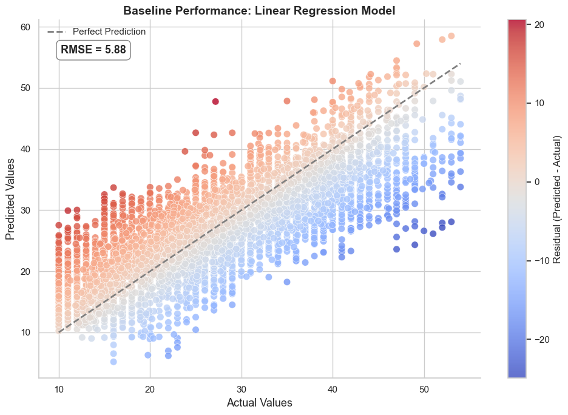
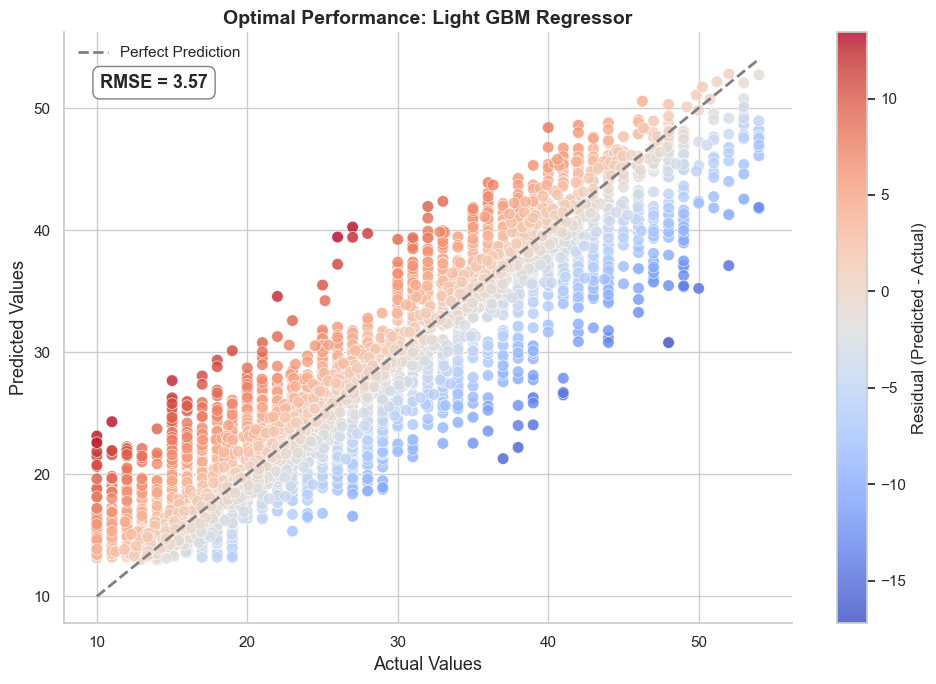

# 🚴‍♂️ Food Delivery Duration Estimation

This project focuses on building a predictive model to estimate **food delivery time** using a public dataset from Kaggle. By leveraging a combination of data preprocessing, feature engineering, and machine learning modeling, this project aims to accurately estimate delivery duration and enhance operational efficiency for food delivery platforms.

---

## 🧠 Project Goal

To predict how long a food delivery order will take — **from pickup to delivery** — using available order, restaurant, and traffic-related data.

---

## 📁 Project Structure

- [1 | Libraries 📚](#lib)  
  Essential imports for data science workflows.
  
- [2 | Exploratory Data Analysis 📊](#data)  
  Insightful visualizations to understand trends, distributions, and data quality.

- [3 | Preprocessing 🎓](#preprocessing)  
  Handling missing values, encoding, feature scaling, and feature engineering.

- [4 | Model Fitting 🧠](#model)  
  Baseline models including Linear Regression, Random Forest, and Gradient Boosting.

- [5 | Light GBM Fine Tuning ⚡](#tune)  
  Hyperparameter optimization with grid search and early stopping.

- [6 | Model Evaluation & Metrics 📈](#metrics)  
  Performance comparison using MAE, RMSE, and MAPE.

- [7 | Final Thoughts & Takeaways 📝](#final-thoughts)  
  Summary of findings and business value.

---

## 🔍 Dataset

- **Source:** [Kaggle - Food Delivery Dataset](https://www.kaggle.com/datasets/gauravmalik26/food-delivery-dataset)
- **Size:** ~45,000 records
- **Features Include:**
  - Order ID, Restaurant location
  - Delivery person ratings
  - Weather & traffic conditions
  - Time taken (target)

---

## 🏆 Key Results

✅ **Best Model:** Fine-Tuned LightGBM  
📉 **Error:** Only **~13% deviation** from real delivery time  
📊 **Evaluation Metric:** Mean Absolute Percentage Error (MAPE)

### 📈 Model Comparison

<p align="center">
  
  
</p>


---

## 🚀 Tools & Technologies

- **Python**
- **Pandas, NumPy, Seaborn, Matplotlib**
- **Scikit-learn, LightGBM**
- **Jupyter Notebook**

---

## 💡 Final Takeaways

- LightGBM outperformed other models with minimal tuning.
- Traffic density, weather conditions, and delivery person ratings were key predictors.
- Feature engineering (e.g., converting time-of-day and city types) played a crucial role.

---

## 📂 Run the Project

```bash
# Clone the repo
git clone https://github.com/yourusername/food-delivery-duration

# Navigate to the directory
cd food-delivery-duration

# Open in Jupyter
jupyter notebook
